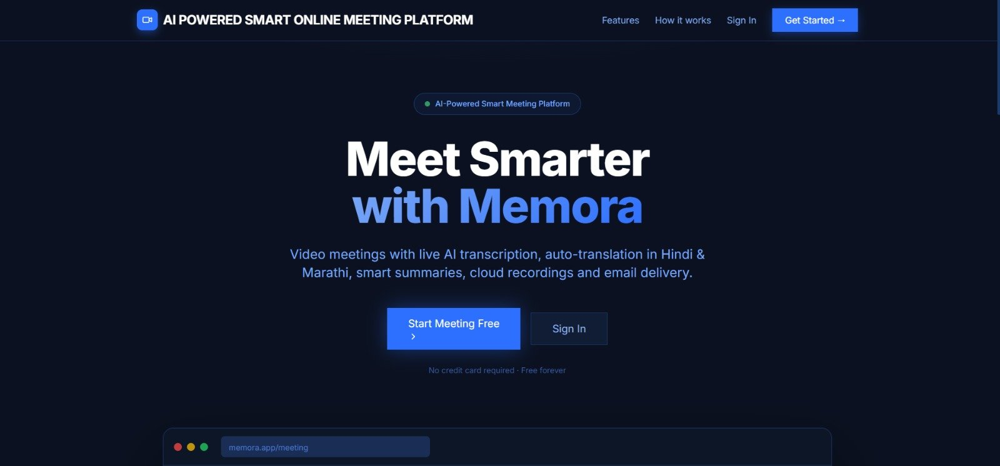
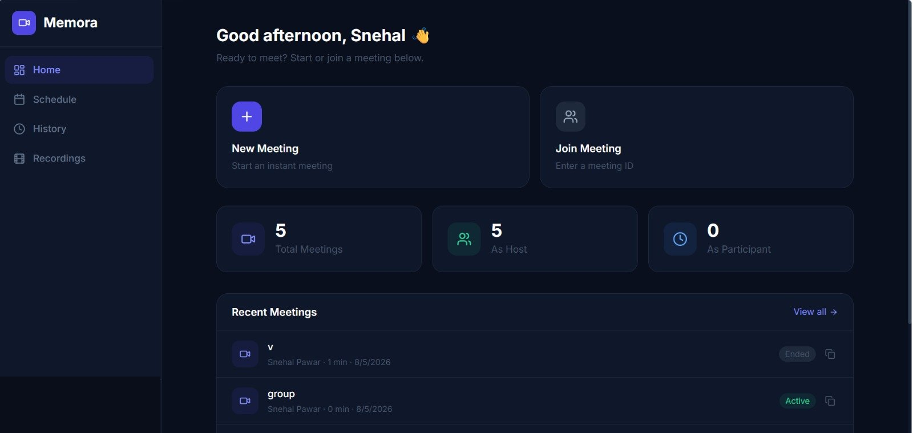
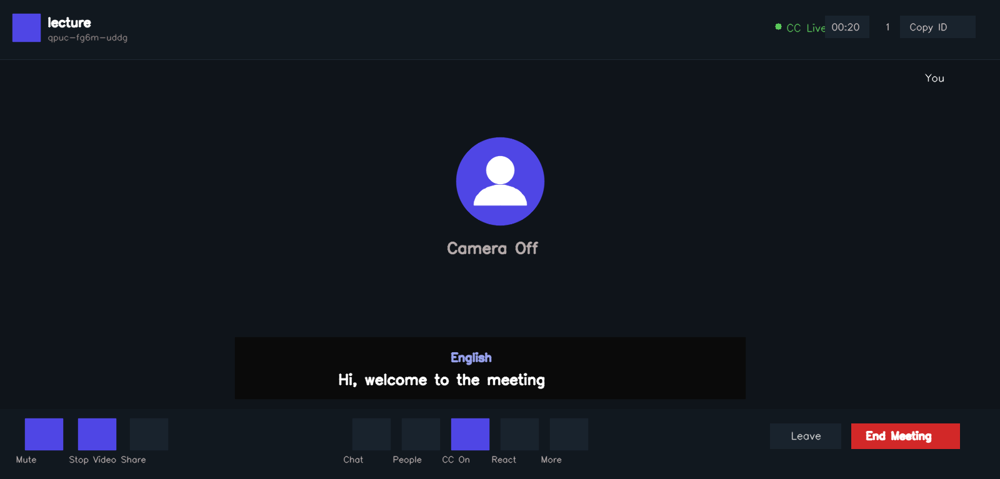
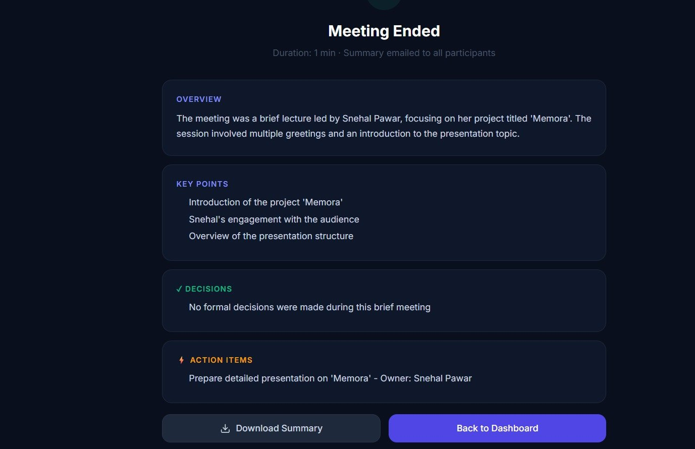
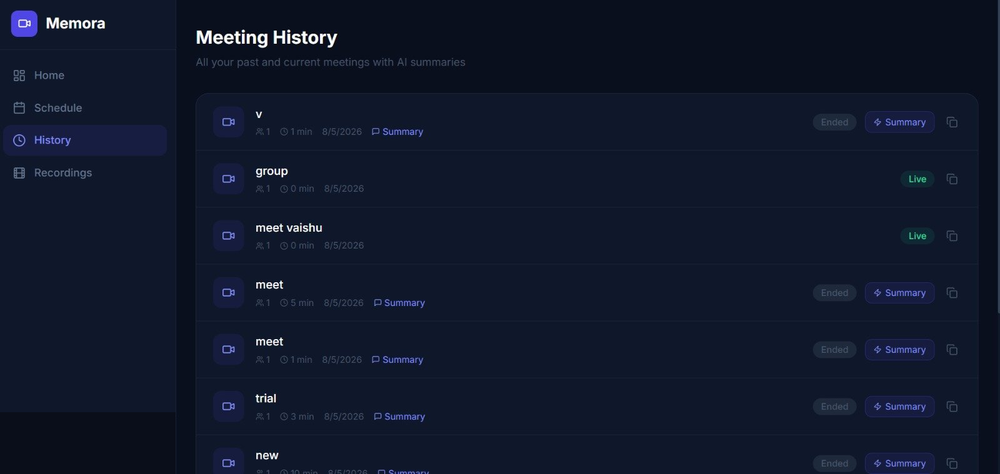

# Memora

### Where Moments Become Memories

An AI-powered smart online meeting platform with live transcription, multilingual auto-translation, AI-generated summaries, and automated meeting reports — delivered straight to your inbox.


**[Live Demo](https://frontend-omega-five-28.vercel.app)** &nbsp;|&nbsp; **[Report Bug](../../issues)** &nbsp;|&nbsp; **[Request Feature](../../issues)**

---

## About The Project

Most video calls end the same way — someone says *"I'll send out notes,"* and nobody ever does.

**Memora** fixes that. It is a full video meeting platform where every call is automatically **transcribed live, translated in real time, summarized by AI, and emailed as a polished PDF report** to every participant — the moment the meeting ends. No manual note-taking, no "can someone send the recap," no forgotten action items.

This project was developed as a **Final Year Engineering Project**, combining real-time communication infrastructure with practical, everyday-useful AI.

### Core Features

| Feature | Description |
|---|---|
| HD Video Meetings | Host or join instantly with a shareable Meeting ID |
| Live Captions + Translation | Real-time captions auto-translated into English, Hindi, or Marathi |
| AI Meeting Summaries | Overview, key points, decisions, and action items generated automatically from the transcript |
| Auto-Generated PDF Reports | A polished, downloadable meeting summary created the moment a call ends |
| Automated Email Delivery | Summary and PDF emailed to every participant with zero manual effort |
| Cloud Recordings | Meetings recorded and stored securely, playable anytime |
| Meeting History | Full log of past and live meetings with quick access to summaries |
| Secure Authentication | JWT-based account protection |

---

## Demo

**Landing Page**



**Dashboard**



**Live Meeting with Real-Time Captions**



**AI-Generated Meeting Summary**



**Meeting History**



> Live captions during a call support real-time auto-translation into Hindi and Marathi, alongside English — built for genuinely multilingual teams.

---

## Live Deployment

| Service | Link | Status |
|---|---|---|
| Frontend (Vercel) | [frontend-omega-five-28.vercel.app](https://frontend-omega-five-28.vercel.app) | Live |
| Backend API (Render) | [backend-2sg0.onrender.com](https://backend-2sg0.onrender.com/api/health) | Live |

> Note: the backend runs on Render's free tier and may take up to 30 seconds to wake up after a period of inactivity.

---

## Tech Stack


| Layer | Technologies |
|---|---|
| Frontend | React.js, Vite, Axios |
| Backend | Node.js, Express.js, Socket.IO, JWT Auth |
| Database | MongoDB Atlas, Mongoose |
| AI / Real-Time | OpenAI API (summaries), VideoSDK (video calls) |
| Email / Storage | Resend (email delivery), Cloudinary (recordings) |
| Infrastructure | Vercel (frontend hosting), Render (backend hosting) |

---

## Architecture Overview

```
+------------------+        HTTPS / REST API         +------------------+
|                  | -------------------------------->|                  |
|  React Frontend  |                                  |  Express Backend |
|     (Vercel)     | <--------------------------------|     (Render)     |
|                  |       WebSocket (Socket.IO)        |                  |
+------------------+                                  +--------+---------+
                                                                |
                  +-------------------+----------------+-------+--------+--------+
                  v                   v                v                v        v
            +----------+      +-------------+   +-----------+   +--------+ +------------+
            | MongoDB  |      |  VideoSDK   |   |  OpenAI   |   |Resend  | | Cloudinary |
            |  Atlas   |      | (Video Call)|   |(Summaries)|   |(Email) | |(Recordings)|
            +----------+      +-------------+   +-----------+   +--------+ +------------+
```

---

## Project Structure

```
memora/
|
|-- frontend/                      React + Vite client
|   |-- src/
|   |   |-- api/
|   |   |   `-- config.js           Axios instance, base URL, auth interceptor
|   |   |-- components/             Reusable UI building blocks
|   |   |-- pages/                  Landing, Login, Dashboard, Meeting Room, History, Recordings
|   |   `-- sockets/                Socket.IO client connection logic
|   |-- public/
|   |-- index.html
|   |-- vite.config.js
|   `-- package.json
|
|-- backend/                       Express + Node API server
|   |-- routes/
|   |   |-- auth.js                 Register / login / JWT issuing
|   |   |-- meetings.js             Create / join / end meetings, transcripts
|   |   `-- recordings.js           Cloud recording metadata and retrieval
|   |-- models/
|   |   |-- User.js                  Mongoose user schema
|   |   `-- Meeting.js               Mongoose meeting schema (transcript, summary, etc.)
|   |-- services/
|   |   `-- emailService.js          PDF generation (PDFKit) and email delivery (Resend)
|   |-- config/
|   |   `-- cloudinary.js            Cloudinary connection config
|   |-- socket/
|   |   `-- socketHandler.js         Real-time meeting events (Socket.IO)
|   |-- server.js                    App entry point
|   `-- package.json
|
`-- README.md
```

---

## Getting Started Locally

### Prerequisites
- Node.js v18 or higher
- A MongoDB Atlas cluster (or local MongoDB instance)
- API keys for: VideoSDK, OpenAI, Cloudinary, Resend

### Installation

```bash
# Clone the repository
git clone https://github.com/SnehalPawar-1709/Memora.git
cd Memora

# Backend setup
cd backend
npm install
# create a .env file with your own keys (see below)
npm run dev

# Frontend setup (in a new terminal)
cd frontend
npm install
# create a .env file with your own keys (see below)
npm run dev
```

The app will run at `http://localhost:5173` (frontend) and `http://localhost:5001` (backend).

### Environment Variables Required

**`backend/.env`**
```
MONGODB_URI=
JWT_SECRET=
FRONTEND_URL=
VIDEOSDK_API_KEY=
VIDEOSDK_SECRET_KEY=
OPENAI_API_KEY=
CLOUDINARY_CLOUD_NAME=
CLOUDINARY_API_KEY=
CLOUDINARY_API_SECRET=
RESEND_API_KEY=
EMAIL_FROM_NAME=
```

**`frontend/.env`**
```
VITE_API_URL=
VITE_SOCKET_URL=
```

> Never commit `.env` files — they are already excluded via `.gitignore`.

---

## Team

Developed as a **Final Year Engineering Project** by:

| Name | GitHub |
|---|---|
| Snehal Pawar | [@SnehalPawar-1709](https://github.com/SnehalPawar-1709) |
| Vaishnavi Deshmukh | [@vaishnavi-deshmukh001](https://github.com/vaishnavi-deshmukh001) |

**Institution:** Yashoda Technical Campus

**Under the guidance of:** Prof. Dr. Sarita Balshetwar, Head of Department, Computer Science and Engineering

---

### Memora — *Where Moments Become Memories*
